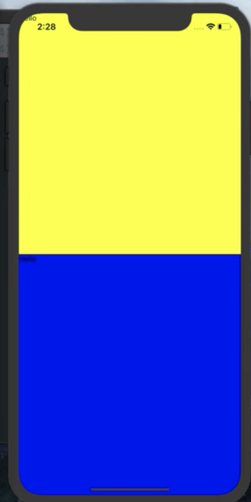

## 1. Layouts with Flexbox

리엑트 네이티브에서 모든 flex box의 디폴트는 flexDirection이 컬럼이다.

```javascript
<View style={styles.container}>
  <View style={styles.yellowView}>
	</View>
  <View style={styles.blueView}>
  </View>
</View>

const styles = StyleSheet.create({
  container: {
    flex: 1,
  },
  yellowView: {
    flex: 1,
    backgroundColor: "yellow"
  },
  blueView: {
    flex: 1,
    backgroundColor: "blue"
  }
});

```

####  

위의 이미지와 같이 위아래로 배열되는 것을 확인할 수 있다. flex:1  (view는 `<div>`같은 것)

container는 아빠야. flex:1를 지워버리면 제대로 동작하지 않음. 

container안의 노랑색 뷰와 파랑색 뷰는 둘다 flex:1이다. 양쪽다 모든 공간을 사용하고 싶어함. 그러면 각자 원하는 만큼 가져감. 즉 반반씩 가져갈 것임. 만약에 blue가 flex:2이면 노란색보다 두배 더 차지할것임.

결국, flex는 화면을 차지하는 비율과 같은 것임. 형제들끼리 경쟁하는것임.

**flex로 레이아웃 코딩 하는것을 권장한다.** 왜? 폰 사이즈가 각각 다른데 각자 폰에 맞춰서 맞춰질 것이기 때문. flex박스로 작업한다면 말이다.


## 2. Loading Screen

```javascript
import Loading from "./Loading";

export default function App() {
    return <Loading/>;
}
```

App.js에 해당 코드처럼, Loading.js를 import해주었다. Loading.js는 로딩화면(스플래시 화면)을 위함.


## 3. Getting the Location

React Native에서 geolocation활용하려면 [http://facebook.github.io/react-native/docs/geolocation.html](http://facebook.github.io/react-native/docs/geolocation.html) 을 참고하면 된다.

Expo는 [https://docs.expo.io/versions/latest/sdk/location/](https://docs.expo.io/versions/latest/sdk/location/) 을 참고하면 된다. 위치 관련된 기능을 어떻게 사용해야할지 알려준다. 위치에 관련된 여러 기능에 관한 설명이 있음. expo는 여러 기능을 제공하지만, 디폴트로 제공되지 않으므로 원하는 것만 인스톨 해야한다.

```
expo intall expo-location
```

위와 같은 명령어로 location 라이브러리 설치


```javascript
import React from 'react';
import Loading from "./Loading";
import * as Location from "expo-location"; //1번

export default class extends React.Component { 
  getLocation = async() => { //2번
    const location = await Location.getCurrentPositionAsync();
    console.log(location);
  }
  componentDidMount(){ 
    this.getLocation(); //3번

  }
    render(){
      return <Loading/>;
    }
}

```

1번 : 다운받은 Location 라이브러리를 import함

2번 : 자바스크립트 비동기. 3번에서 호출하면, 그때 현재위치 가져오게끔.  Location.getCurrentPOstionAsync()는 기다려야 하므로 따로 함수만들어서 async로 빼줌. async()는 기다리란 뜻!


## 4. Asking for Permissions

```javascript
getLocation = async() => {
    try{
      //throw Error(); 이것처럼 에러를 던져주면 아래의 alert창이 무조건 뜸.
      await Location.requestPermissionsAsync();
      const {coords} = await Location.getCurrentPositionAsync();
      console.log(coords.latitude, coords.longitude);
    }catch(error){
      Alert.alert("Can't find you.", "So sad");
    }
  }
```

위에서 const {coords} 는 뒤의 await Location~을 해주면 object가 반환되는데, 

```json
Object {
  "coords": Object {
    "accuracy": 5,
    "altitude": 0,
    "altitudeAccuracy": -1,
    "heading": -1,
    "latitude": 33.3333,
    "longitude": -120.00000,
    "speed": -1,
  },
  "timestamp": 1578754651930.0352,
}
```

와 같은 형식이다. 저기의 coords를 가져오는 것임.

```javascript
const {
  coords: {latitude,longitude}
} = await Location.getCurrentPositionAsync();
```

위처럼 받기


## 5. Getting the Weather

날씨 api 제공 사이트 : [https://openweathermap.org/current](https://openweathermap.org/current) 

```
npm install axios
```

`axios`를 인스톨한다. axios는 HTTP 클라이언트 라이브러리로써, 비동기 방식으로 HTTP 데이터 요청을 실행합니다

```javascript
getWeather = async(latitude,longitude) => {
    const {data}  = await axios.get(
      `http://api.openweathermap.org/data/2.5/weather?lat=${latitude}&lon=${longitude}&APPID=${API_KEY}` //백틱을 사용
    );
    console.log(data);
  }
```

해당 방식처럼 data가져오기