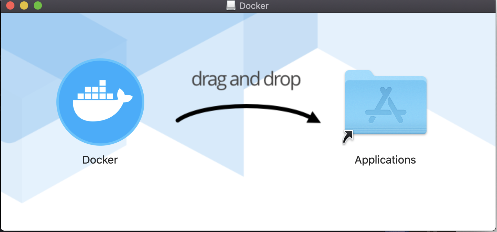

[도커가 무엇인지 공부하기](https://yujieun.github.io/whatisdocker/) 에 이어서 두번째 작성하는 글이다. 이번에는 도커 설치와 컨테이너를 실행하고 컨테이너를 둘러보는 것까지 할 것이다. 마찬가지로, 이번에도  [초보를 위한 도커 안내서](https://subicura.com/2017/01/19/docker-guide-for-beginners-2.html) 블로그를 참고하며 공부했다.

------

## 도커 설치하기

[docker install for mac](https://hub.docker.com/editions/community/docker-ce-desktop-mac)  도커 홈페이지에 접속하여 다운로드한다. 이때 회원가입이 필요하다.

회원가입 후, Mac(stable)을 선택하여 다운로드 

Docker.dmg설치 후 Application으로 이동



**Docker Desktop is starting** 이라는 문구가 -> **Docker Desktop is running**으로 바뀌면 정상적으로 도커가 실행된 것임.

터미널에서

```
docker -v
```

을 입력하면, Docker version 19.03.5, build ... 과 같은 문장이 뜨면서 도커 버전을 확인할 수 있음

```
docker version
```

버전정보가 클라이언트와 서버로 나뉘어져있음. 도커는 하나의 실행파일이지만, 실제로 클라이언트와 서버역할을 각각 할 수 있음. 도커 커맨드를 입력하면 도커 클라이언트가 도커 서버로 명령을 전송하고 결과를 받아 터미널에 출력해 줌.


## 도커 명령어

| 명령                   | Docker -v                                             |
| ---------------------- | ----------------------------------------------------- |
| 버전 확인              | docker -v                                             |
| 이미지 다운로드        | docker pull [이미지 명]                               |
| 다운로드된 이미지 목록 | docker images                                         |
| 컨테이너 생성          | docker create [옵션] [이미지 명]                      |
| 컨테이너 생성 및 실행  | docker run [옵션] [이미지 명]                         |
| 컨테이너 실행          | docker start [컨테이너 명]                            |
| 컨테이너 재실행        | docker restart [컨테이너 명]                          |
| 컨테이너 접속          | docker attach [컨테이너 명]                           |
| 컨테이너 정지          | docker stop [컨테이너 명]                             |
| 실행중인 컨테이너 목록 | docker ps                                             |
| 정지된 컨테이너 목록   | docker ps -a                                          |
| 컨테이너 명 변경       | docker rename [기존 컨테이너 명] [새로운 컨테이너 명] |
| 컨테이너 삭제          | docker rm [컨테이너 명]                               |

## 컨테이너 실행하기

```
docker run [옵션] [이미지 명]
```

명령어로 도커 생성하고 실행하본다.

이때 자주 사용하는 옵션은 다음이 있다.

| 옵션  | 설명                                           |
| ----- | ---------------------------------------------- |
| -d    | 백그라운드 모드                                |
| -p    | 호스트와 컨테이너의 포트 연결(포워딩)          |
| -v    | 호스트와 컨테이너의 디렉토리를 연결(마운트)    |
| -name | 컨테이너 이름 설정                             |
| -rm   | 프로세스 종료시 컨테이너 자동 제거             |
| -it   | -i와 -t동시에 사용한 것으로 터미널 입력을 위함 |
| -link | 컨테이너 연결[컨테이너명 : 별칭]               |

몇번 사용해보면 자연스럽게 익숙해진다고 하니까 많이 써보자 ㅎ.ㅎ

### Ubuntu 16.04 container

일단 ubuntu 16.04 컨테이너 생성하기

```bash
yujieun-ui-MacBookPro:~ yujieun$ docker run ubuntu:16.04
Unable to find image 'ubuntu:16.04' locally
16.04: Pulling from library/ubuntu
0a01a72a686c: Pull complete 
cc899a5544da: Pull complete 
19197c550755: Pull complete 
716d454e56b6: Pull complete 
Digest: sha256:3f3ee50cb89bc12028bab7d1e187ae57f12b957135b91648702e835c37c6c971
Status: Downloaded newer image for ubuntu:16.04
```

run명령어를 사용하면, 사용할 이미지가 저장되어 있는지 확인하고, 없다면(Unable to find image ~locally) 다운로드한 후 컨테이너 생성하고 시작함.

위의 예제는, 컨테이너가 정상적으로 실행됐지만 명령어를 전달하지 않았으므로 생성되자마자 종료.

**컨테이너는** `프로세스`**이므로 실행중인 프로세스가 없으면 컨테이너는 종료됨**.

------


```bash
yujieun-ui-MacBookPro:~ yujieun$ docker run --rm -it ubuntu:16.04 /bin/bash

root@06cf64f8232e:/# cat /etc/issue
Ubuntu 16.04.6 LTS \n \l v  

root@06cf64f8232e:/# ls
bin   dev  home  lib64  mnt  proc  run   srv  tmp  var
boot  etc  lib   media  opt  root  sbin  sys  usr
```

컨테이너 내부에 들어가기 위해 bash쉘을 실행하고, 키보드 입력을 위해 -it옵션을 줌. 프로세스가 종료되면 컨테이너가 자동으로 삭제되도록 -rm옵션 추가

`cat /etc/issue`와 `ls`를 실행하보면 ubuntu 리눅스인것을 알 수 있음. 

마치 가벼운 가상머신 같다.

`exit` 로 bash쉘 종료하면 컨테이너도 같이 종료됨.

------

### redis container

두번째로, redis컨테이너를 만들어보자. redis는 메모리기반의 다양한 기능을 가진 스토리지이다. 6379포트로 통신하며 telnet 명령어로 테스트해볼 수 있다. `-d`옵션을 주어 백그라운드 모드로 실행하고(-d옵션이 없다면, 프로세스가 foreground로 실행되어 아무키도 입력할 수 없게 된다.) `-p`옵션을 추가하여 컨테이너의 포트를 호스트의 포트로 연결한다.

```
docker run -d -p 1234:6370 redis
```

`-d`옵션을 주었기 때문에 컨테이너를 실행하자마자 컨테이너의 id를 보여주고 바로 쉘로 돌아옴. (백그라운드 모드로 동작. 컨테이너의 id를 이용하여 컨테이너 제어 가능) `-p`옵션으로 호스트의 1234포트를 6379포트로 연결. localhost의 1234포트로 접속하면 redis사용 가능.


### MySQL 5.7 container

3번째로, mysql 컨테이너 실행하기. `-e`옵션 이용해서 